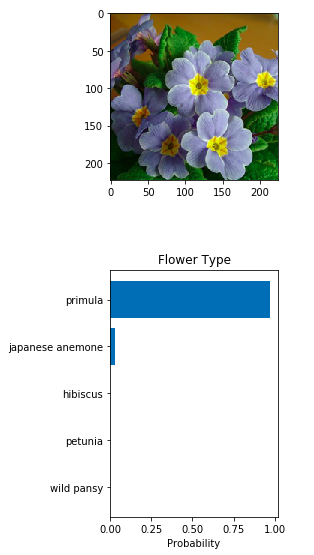

# AI Programming with Python Nanodegree

This is the capstone project for _Capstone for AI Programming with Python Nanodegree_ @ Udacity.

## Components

This project was developed with [Python 3.x](https://www.python.org/), [PyTorch](https://pytorch.org/) and [Jupyter Notebook](https://jupyter.org/).

### Jupyter Notebook

The [notebook](<Image Classifier Project.ipynb>) was used to help achieve the development of the final model configuration.

It relies on the VGG16 pre-trained model, with 25088 x 4096 x 1024 x 256 x 102 layers and a 10% dropout.

### CLI Application

The CLI app was based on the model previously developed, adding the capacity to select other pre-trained models, such as *alexnet* and *resnet*.

More information on operating *train.py* and *predict.py* can be obtained with the **-h** flag.

## Results

*Develop the network, test, validate and assess its accuracy.*

Validation and test reached approximately **84%** and **82%**, respectively.

The model was able the classify a *primula* flower with **97%** of certainty.

